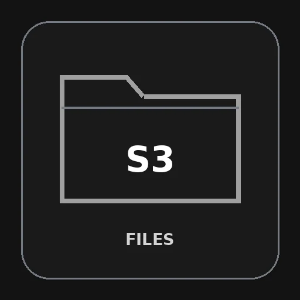

# File Browser S3 access

Browse and manage files in Amazon S3 or compatible cloud storage directly from Agent Zero’s File Browser. Connect a bucket, or choose a folder within it.

## Compatibility

**Requires Agent Zero v2.12 or later.**

## Install and configure

1. Open **Plugin Hub**, find **File Browser S3 access**, and install it.
2. Enable the plugin globally, then open its settings and choose **Open connection settings**. You can also go to **Files → Settings → Add connection** and choose this plugin.
3. Enter the connection details described below, give the connection a name, and save it.
4. Test the connection, then use its folder icon to open your files.

Enter a bucket, region, optional key prefix, access key ID and secret access key. Temporary credentials may include a session token. Leave endpoint empty for AWS or enter a verified HTTPS S3-compatible endpoint. Credentials must grant only the desired bucket/prefix operations; no ambient instance credentials are used.

## Use and permissions

Each connection has independent Browse, Download, Upload/create, Edit, Rename/move and Delete controls; unsupported actions are disabled. Browse and Download default on; mutations default off. Text and code files open in the shared Editor. Files supports list/icon views and the optional file tree for remote connections.

Permissions constrain File Browser operations, not arbitrary agent shell tools or server accounts. Editing necessarily reveals file content. Credentials are stored privately (0600) under this plugin's `data/connections.json` and are omitted from browser responses. An unchanged secret retains its saved value; replacing it updates it. Protect the instance and its backups.

## Limits

Folders are prefixes and empty-folder markers, not POSIX directories. Rename/move is deliberately unavailable because S3 lacks atomic rename. Conditional puts must be supported by a compatible endpoint. Deleting a versioned object creates a delete marker; this plugin does not purge old versions. Object and prefix names that collide cannot be represented independently in the file-browser view. Browsing and requests may incur provider charges.

Set size limits in File Browser settings: transfers default to 100 MiB, text editing to 10 MiB, and archives to 1,000 entries. Transfers stream through temporary files; text editing supports UTF-8 files without binary content. Cross-connection moves and remote-to-local Save As are not supported. Use download/upload to transfer between connection types. Agent Zero must be able to reach the configured server; storage/network charges remain your provider's responsibility.

## Technical details

The adapter uses the Agent Zero v2.12 streaming interface: `read(relative, destination, limit)` writes bounded chunks and returns a revision; `write(relative, source, expected=None)` consumes a seekable binary stream and returns the new revision. Transfer limits come from File Browser settings.

Dependencies: boto3 1.43.36. The installer calls `hooks.py install()` in the Agent Zero framework runtime. It is safe to rerun; there is no execute.py.

## Verification

Transport checks cover streamed transfers above 1 MiB, size-limit rejection, and safe-write behavior. Tests use disposable local servers or SDK mocks, without production credentials.

Botocore Stubber checks verify bucket/prefix requests and If-None-Match/If-Match writes, including failed preconditions. Run `PYTHONPATH=/a0 python -m unittest -v test_transport` from the repository inside the Agent Zero container, using its framework interpreter. No paid cloud account or actual object store was used in automated validation.

Before production use, test a disposable folder on your actual server: listing, new upload, Editor save, duplicate destination rejection, stale-save rejection, download, rename where supported, and deletion. Confirm denied actions remain denied and disable the plugin to confirm connections become unavailable. Protocol differences and server permissions matter.

## Disable and remove

Disabling hides this provider and rejects further connection operations. Removing a connection deletes its saved credentials. Uninstalling deletes the plugin directory, including saved connections and any plugin-owned key; back up what you need first. Shared Python dependencies are not uninstalled because other plugins may use them. No service, mount or system symlink is created.

## License

MIT. See [LICENSE](LICENSE). Agent Zero-derived integration retains its upstream license notice.
